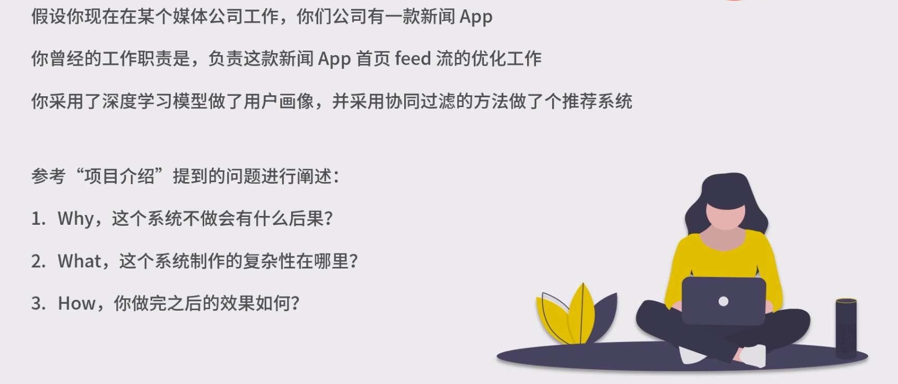

# 技术面试

## 软素质

### 技术面试的流程

1. 简历筛查

1.1 **简历是第一印象**，奠定了你在面试官心中的印象。

- 从简历就可以看出来候选人对问题的理解程度大致的段位，求职的预期，甚至是面试的结果。

一些示例：

- 简历信息中包含：政治面貌、户籍、3 年前获得的奖学金情况等信息，就可以看成候选人**眼界可能比较有限，对事情重要性的判断能力可能不足。**原因是这些信息不是此次求职加分项，写在仅有一张纸篇幅的简历中，就显得信息有些冗余了。

  2.1 好的简历要满足的必要条件：

- 信息完备 - 必备的东西不能缺，如，姓名、学历、联系方式、工作经历等
- 抽象概括 - **可有可无的东西不要写，**如：研究生的导师(除非是院士级)、政治面貌、户籍等。
- 重点突出 - 对你有利的东西要放大加粗，如：电话号，S 绩效，系统性能分析提高 50%等。

2. 自我介绍

2.1 自我介绍是面试过程中的第一个环节，**建议时长控制在 5 分钟左右。**也是奠定第一印象的环节，更是被很多候选人忽视的问题。

- 「自我介绍」介绍一下自己的基本情况即可，不需要太深入的介绍项目。建议**尽量按时间顺序分阶段介绍**，然后高度抽象总结出来。
- 以 10 句话左右为限制，说的时候语速放慢、吐字清晰、注意抑扬顿挫。
- 注意：自我介绍环节的重点是**介绍自己**，不是项目介绍，不要长篇的介绍项目技术方案和技术细节。

  2.2 尝试「模拟自我介绍」：

- 尝试给自己的父母做一遍自我介绍，喝口水或上个厕所。过了 10 分钟，再给自己的父母做一遍自我介绍，如果**你两次自我介绍的内容，话术、吐速基本相同**，说明自我介绍的准备工作比较充分了，如果两次介绍的差别比较大，说明准备不是很充分。

`tips：如果面试紧张(心里原因)的话，可以认真准备一份自我介绍稿，仔细打磨里面的内容。面试过程中，心态和自信非常重要，整个面试流程其实是一环扣一环的，如果心里素质不是很强大的话，一个环节出问题，可能导致整个面试崩掉。`

3. 项目介绍

3.1 项目介绍一般需要**25 分钟左右**，包括候选人自己阐述项目核心的内容，以及面试官就不明确的地方进行发问。

- 同样，「项目介绍」也是很多人忽视的内容，**很多人都错误的认为对于亲手做个的项目细节都了如指掌。**即使别人问很细节的东西，自己也不会答不出来。**这种观念大错特错，**面试官会关注你过往项目的实现方法，技术细节，但更加关注你项目背后问题的定位，目标定义，技术选型。简单来说，就是**到底你遇到了什么问题，选择什么方法，做了什么事情。**根据经验，很多研发工程师都在瞎忙。

工程师就像是系统发明者，如果每天都是瞎忙的话，就很可能用来很酷的技术，做了一件毫无用处的事情。

3.2 **关于项目介绍的几点建议：**

- 在项目中，你解决了什么问题？不解决会有什么后果（问题的本质是：why）？

面试时切记不要上来就说我做了什么？好的回答是，**从问题出发，**一定是公司遇到了某个必需要解决的问题(系统问题，业务问题)，最终导致你去做了什么对应的事情。

- 这个问题的复杂性在哪里？在解决它的过程中需要具备哪些能力(问题背后的问题(本质)是：what)？

找到问题的关键点和复杂性，再以此，提炼出技术问题，寻找解决方案。

- 这个问题被你解决了多少？取得了哪些业务收益（问题的本质：how，即最终的结果）？

如：一个项目，如果有你没你都一样，那么就是瞎忙的一个项目，如果有了你，使得公司每年节约了 XX 元的的成本，这就是你真实取得的业务收益。

举个例子：

4. 技术考察

4.1 技术考察一般持续 15 分钟左右，考核的是**专业知识和专业经验**，如：设计模式，数据结构，机器学习和 ai 技术。

- 考察的重点会根据不同的岗位进行侧重，建议：**在技术深度上达到一般水平。**

5. 手写代码

5.1 手写代码一般是 1~2 个题目，持续时间约 10 分钟左右。

6. 开放性问题

> 注意：开放性问题隐藏在面试的整个中。

6.1 开放性问题，集中在面试最后的 5~10 分钟，考核的是候选人的综合能力。

综合能力包括但不限于如下：

- 对行业的理解
- 对问题的分析
- 对观点的表达

`注意：这个环节的评价非常主观，很难有对错之分。`

但一些好的建议如下：

- 不要不懂装懂
- 不要夸大其词
- 不要尝试忽悠别人
- 尽量给面试官留下踏实、理性、客观的印象，做到知之为知之，不知为不知。

## 简历评价

1. 

2. 

3. 

4. 

## 要点

1. 从本质来看，技术面试就是一次**交流和讨论**，作为候选人一定不能降低身份，表现出求着对方收留的感觉。

2. 面试与相亲类似，是一种双向选择的过程。

3. 在面试过程中，面试者一直在动态维护一个在面试官心中好感度得分，不断地展现出你的优秀，好感分会越来越高。

4. 真正影响面试结果的是：技术硬实力和技术基本功。
